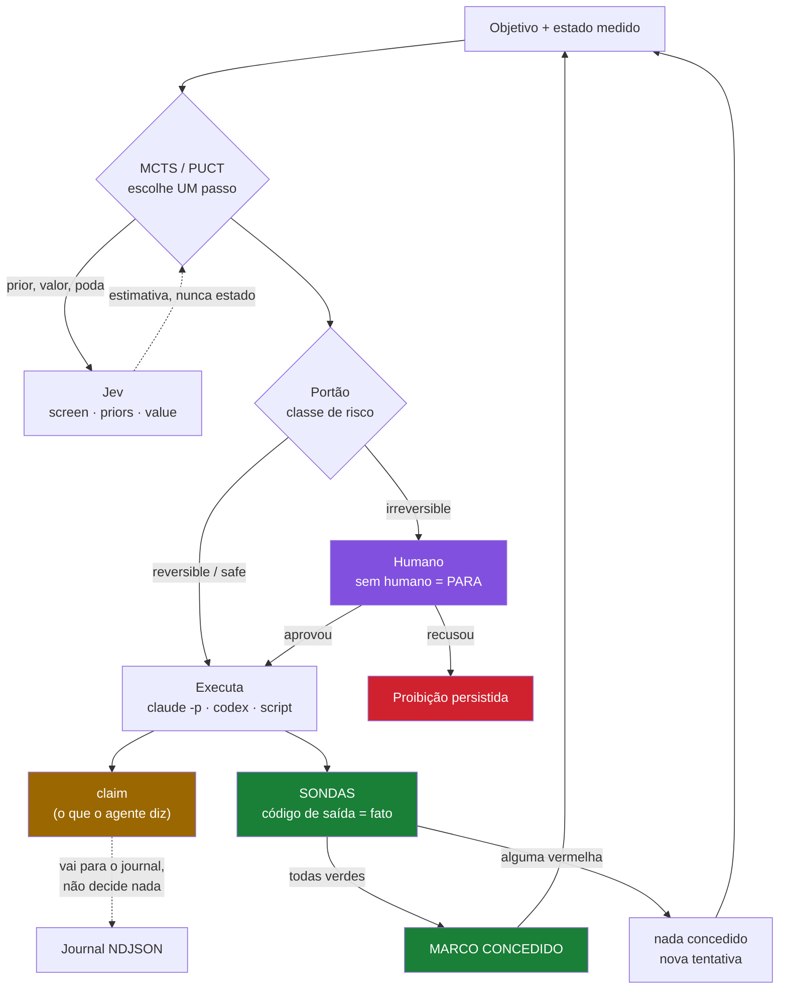

<div align="center">

# jev-mcts

**Busca em árvore (MCTS/PUCT) com avaliação tipada do [TypeSafe Jev](https://typesafe.ai/)
e portão humano obrigatório nas decisões que não dá para desfazer.**

*A árvore supõe. A sonda mede. Só a sonda concede.*

[](https://github.com/paulobueno164/jev-mcts/actions/workflows/ci.yml)
[](https://nodejs.org)
[](https://www.typescriptlang.org/)
[](#testes)
[](LICENSE)
[](https://vercel.com/changelog/typesafe-ai-jev-now-available-on-ai-gateway)

</div>

É uma releitura do [lhemerly/mcts-agent](https://github.com/lhemerly/mcts-agent) com
uma correção no centro: **a árvore só tem direito a ir fundo onde existe um
simulador.** Onde não existe, ela é rasa, é rotulada como especulativa, e para
na mesa de um humano.

---

## O laço, em um diagrama



O nó verde é o único que concede. O nó amarelo — o texto que o agente escreveu
dizendo que deu tudo certo — vai para a auditoria e **não** decide nada.

---

## A tese

MCTS precisa de duas coisas que o xadrez dá de graça: aplicar uma ação e obter o
**próximo estado real**, e uma **recompensa aterrada** no fim. Num fluxo de
trabalho de software não existe nenhuma das duas. Uma árvore construída sobre o
palpite de um modelo sobre o que o estado *viraria*, pontuada por outro modelo,
não reduz incerteza com profundidade — ela compõe erro.

Este repositório separa os dois regimes no tipo, não no comentário:

| | `fidelity: 'grounded'` | `fidelity: 'speculative'` |
|---|---|---|
| `apply()` devolve | o estado real | uma suposição |
| profundidade | até `maxDepth` | teto **duro** de 2, recortado em runtime |
| valor da folha | `reward()` do ambiente / playout real | nota do avaliador |
| relatório | "medido" | "estimado — nada foi executado" |
| portões | normais | apertados |

`rollout()` **lança exceção** se chamado em ambiente especulativo. Rolar adiante
uma transição inventada não é medição, e o código diz isso em vez de confiar em
quem leu a documentação.

### "Mas a profundidade não está travada em 2?"

É a primeira pergunta de quem lê o código, e a resposta é **não — ela é travada
em 2 só onde não existe simulador.** O teto é calculado assim
([`mcts.ts:134`](src/search/mcts.ts#L134)):

```ts
const depthCap =
  env.fidelity === 'speculative'
    ? Math.min(config.maxDepth, config.speculativeMaxDepth)  // 2
    : config.maxDepth;                                        // 24
```

Medido nos dois ambientes que acompanham o repositório:

| ambiente | `fidelity` | `depthCap` | recortado? |
|---|---|---|---|
| `examples/duel` — partida com regra fechada | `grounded` | **24** | não |
| `src/agent/workspace` — o laço com um CLI | `speculative` | **2** | sim |

O duelo é onde a árvore vai fundo, e é onde ela ganha: **24/24 contra 1/24** do
guloso, com jogos de 7 a 8 lances. Se o teto fosse 2 em todo lugar, esse número
não existiria — busca de 2 plies não separa de um guloso.

O laço do agente roda com teto 2 porque `apply()` ali é um **palpite**: ninguém
sabe qual será o estado do repositório depois que o `claude -p` rodar, só dá para
descobrir rodando. Empilhar 10 níveis de palpite sobre palpite produz uma árvore
bonita e um número sem significado. Então a árvore é rasa, o relatório escreve
`0/12 folhas medidas — tudo estimado`, e quem decide de verdade é a sonda.

Isso é um **limite do ambiente, não do buscador**. No dia em que alguém escrever
um `Environment` `grounded` para um repositório — um sandbox que aplique a
mudança e devolva o estado real —, o mesmo código passa a buscar a 24 sem trocar
uma linha do MCTS.

---

## O que mudou em relação ao mcts-agent

| mcts-agent | aqui |
|---|---|
| Gemini gera ações — **uma chamada de LLM por expansão de nó** | catálogo tipado vindo do ambiente; **nenhuma chamada de LLM na expansão** — e nenhum proposer com LLM, o que é uma limitação real (ver *Limites conhecidos*) |
| Jev dá prior, valor e poda; profundidade livre | mesmo papel, mas o valor vem do ambiente sempre que o ambiente sabe medir; profundidade recortada quando especulativo |
| confiança crua do modelo nos cortes (≥0.8, ≥0.85) | confiança **calibrada** contra verdade resolvida por busca exata; sem curva ajustada os cortes apertam e o relatório avisa |
| estado do nó é uma descrição textual | estado é o tipo do ambiente; o texto é só o que o avaliador vê |
| — | orçamento (chamadas, tokens, USD, relógio) com parada limpa |
| — | cache por conteúdo + journal NDJSON + `replay` que refaz a corrida sem rede e falha se divergir |
| — | portão humano tipado por classe de risco; "recusar" vira proibição persistente |
| — | ordem dos candidatos embaralhada por RNG semeado (viés de posição), `debiasPasses: 2` para média com a ordem invertida |

---

## Rodando

Tudo roda **offline**, com um avaliador roteirizado determinista no lugar do Jev.
As chaves só são necessárias para `--evaluator jev`.

```bash
pnpm install
pnpm check
```

```bash
pnpm duel        # bancada: guloso x busca, em ambiente com verdade conhecida
pnpm devtask     # fluxo de orquestração com o humano no laço
pnpm calibrate   # ajusta a curva de confiabilidade contra verdade exata
```

```bash
pnpm devtask -- --interactive
```

### Ligando o Jev de verdade

Copie `.env.example` para `.env` (o `.env` esta no `.gitignore`; o `.env.example`
nao) e preencha `AI_GATEWAY_API_KEY` — a chave sai do painel da Vercel em
**AI Gateway > API Keys**. `TYPESAFE_AI_API_KEY` vale como alias. Os scripts do
`package.json` carregam o `.env` com `--env-file-if-exists`; nada carrega `.env`
sozinho fora deles.

Confira com **uma chamada** antes de gastar uma corrida inteira:

```bash
pnpm ping
```

Medido em 17/09/2026, com chave de conta **hobby**:

| forma    | latencia | tokens de entrada | resultado |
| -------- | -------- | ----------------- | --------- |
| `screen` | 1957 ms  | 547               | 3 probabilidades, uma por candidato |
| `priors` | 460 ms   | 417               | distribuicao + `top` |
| `value`  | 513 ms   | 381               | nivel 1 de 4 => 0.333 |

A primeira chamada paga o aperto de mao; as seguintes ficam em ~0,5 s.

**ZDR e recurso pago.** O adaptador liga `zeroDataRetention` por default, e em
conta hobby o Gateway recusa a chamada inteira com HTTP 500
(`ZDR is only available for Pro and Enterprise plans`) antes de avaliar qualquer
coisa. Em conta hobby, use `--no-zdr` — e saiba que o prompt passa a ir para o
provider:

```bash
pnpm ping --no-zdr
pnpm agent --spec examples/build/selfcheck.json --evaluator jev --no-zdr
```

---

## Os números

Medidos nesta máquina, não citados de benchmark de terceiro. Reproduza com
`pnpm duel --scenarios 24 --iterations 300`.

### Bancada do duelo — 24 cenários, verdade conhecida

| braço | vitórias | recompensa | turnos | chamadas | cache | US$ | lat@114ms |
|---|---|---|---|---|---|---|---|
| guloso (1 ply, sem busca) | 1/24 | 0.042 | 6.3 | 0 | 0 | 0 | 0s |
| mcts, prior plano | 24/24 | 1.000 | 8.0 | 5 893 | 9 105 | 0.101 | 672 s |
| mcts, prior do avaliador | 24/24 | 1.000 | 7.0 | 2 743 | 4 977 | 0.047 | 313 s |

O duelo é desenhado em cima do caso que uma heurística de 1 ply não enxerga: o
golpe de maior dano por recarga vence toda comparação local e perde a luta,
porque o golpe que cura tem recompensa atrasada. A busca resolve isso sem
ninguém escrever limiar nenhum — **1/24 → 24/24**.

O prior do avaliador não mudou o desfecho: mudou o **custo** (2 743 chamadas em
vez de 5 893) e o número de turnos até a vitória (7.0 em vez de 8.0). É esse o
tamanho honesto do ganho neste ambiente.

E leia a última coluna antes da coluna de dólares. `lat@114ms` projeta a
latência se essas chamadas fossem ao Jev de verdade, em série. Os US$ 0,05 são
irrelevantes; os **5 minutos por 24 partidas** decidem se a árvore cabe dentro de
um laço de trabalho. Essa, e não o preço, é a restrição real.

### Calibração — o avaliador é bom nisto?

`pnpm calibrate --states 60` resolve cada estado amostrado por **busca exata**
sobre o ambiente determinista e compara a nota do avaliador com a verdade. Com o
substituto offline (uma heurística plausível que prefere dano bruto):

```
acurácia (corte 0.5): 0.495
Brier               : 0.4542   (0.25 = moeda; menor é melhor)
ECE                 : 0.5337
Spearman (valor)    : 0.429
```

Ou seja: a bancada **detecta** que aquele avaliador não vale nada para essa
pergunta. Era esse o ponto. Um número de acurácia publicado por um fornecedor
diz respeito ao conjunto dele; o que importa é o seu.

A curva ajustada vai para `data/calibration.json` e carrega o `model` em que foi
ajustada. `loadCalibration()` **recusa** uma curva de outro avaliador e volta à
identidade — uma curva emprestada é pior que nenhuma, porque dá aos portões uma
confiança falsa com aparência de aferida.

### Orquestração — onde o humano entra

`pnpm devtask` roda o fluxo inteiro com uma política fixa no papel do humano
(recusa produção e refatoração fora de escopo, aprova o resto):

```
passo 5 [autonomo] abrir-pr  risco=reversible  visitas=67  valor=0.903  margem=0.442
          valor: 0/120 folhas medidas — tudo estimado pelo avaliador, nada foi executado
passo 6.1 [humano:reject] publicar  risco=irreversible  visitas=45  margem=0.250
          valor: 0/120 folhas medidas — tudo estimado pelo avaliador, nada foi executado
          portao: irreversible-action
          humano: "producao so depois de revisao humana do PR"
passo 6.2 [humano:approve] escrever-teste  risco=reversible  visitas=24  margem=0.000
          valor: 0/120 folhas medidas — tudo estimado pelo avaliador, nada foi executado
          portao: narrow-margin
...
parou por : bloqueado — so restavam acoes que o humano recusou
decisoes  : 4 autonomas, 11 escaladas ao humano, 7 recusadas
valores   : 0 decisoes 100% medidas, 8 com folha estimada
folhas    : 0 medidas de 960 (0%), 960 estimadas pelo avaliador
```

A linha `valor:` nunca traz um rótulo solto. Ela traz o numerador e o
denominador, porque uma busca **mista** existe: dizer "medido" numa decisão em
que 3 de 200 folhas foram medidas é a forma mais barata de enganar quem lê.

Terminar **bloqueado** é o resultado certo: o único caminho até o fim passava por
uma ação irreversível, o humano disse não, e o agente parou em vez de encontrar
um jeito de contornar.

---

## Arquitetura

```
src/core/         tipos, RNG semeado, hash estável, orçamento, journal NDJSON
src/env/          Environment<S> + a distinção grounded/speculative
src/evaluator/    interface de 3 formas (screen/priors/value)
                    jev.ts       adaptador real (AI SDK experimental_evaluate)
                    scripted.ts  substituto offline determinista
                    cache.ts     memoização por conteúdo + avaliador de replay
                    calibration.ts  curva de confiabilidade, Brier, ECE, Spearman
src/search/       MCTS com PUCT, First-Play Urgency, alargamento progressivo
src/orchestration/ portões, porta humana, overrides persistentes, o laço
src/agent/        o laço com um CLI externo (Claude Code, Codex, o que for)
                    process.ts   spawn sem shell, timeout, prompt por stdin
                    probe.ts     comando cujo código de saída é um fato medido
                    runner.ts    adaptadores de CLI (template e presets)
                    workspace.ts ambiente especulativo + executor que re-observa
                    session.ts   persistência: é o que torna o laço retomável
src/report.ts     relatório que nunca deixa "estimado" passar por "medido"
```

### Como o Jev é chamado

A API aceita **um estado e N perguntas** por chamada, e não faz lote entre
estados. Então:

- **`screen`** — triagem de candidatos: um *slate* com todos os candidatos vira
  uma chamada com uma pergunta booleana por candidato (em blocos de 16, porque o
  contexto é de ~32k tokens). `N` candidatos custam **1** chamada, não `N`.
- **`priors`** — uma pergunta `choice` cujos critérios são os candidatos; as
  `probabilities` viram o prior `P(s,a)` do PUCT.
- **`value`** — uma pergunta `score` sobre uma rubrica, normalizada para `[0,1]`.
  **Só é chamada quando o ambiente não sabe medir**, e o resultado sai marcado
  como `jev-score` no relatório.

A ordem dos candidatos é embaralhada por RNG semeado antes de virar pergunta:
classificador tem viés de posição. `debiasPasses: 2` repete com a ordem invertida
e tira a média — custa o dobro e remove o viés de ordem.

### Onde o Jev **não** entra

- não decide o que é irreversível (isso é o catálogo de ações);
- não produz o próximo estado (isso é `env.apply`);
- não dá o valor da folha quando o ambiente sabe medir;
- não tem voto no portão: o portão lê números, e um deles é a confiança
  calibrada — não a crua.

---

## O laço com um agente de CLI

`jev build` fecha o ciclo com uma ferramenta externa — `claude -p`, `codex exec`,
qualquer binário que aceite um prompt e edite o repositório:

```
busca (especulativa)  →  portão  →  [humano]  →  agente de CLI  →  SONDAS  →  estado observado
                                                                      ↑
                                                                 volta ao topo
```

A regra que sustenta o resto: **a árvore supõe, a sonda mede.** Uma sonda é um
comando cujo *código de saída* é um fato (`tsc --noEmit`, `vitest run`, um script
que confere se o arquivo existe). Um marco só é concedido quando as sondas
declaradas em `verify` ficam verdes. O stdout do agente entra no estado com o
nome `claim` e **não decide nada** — se ele escrever "pronto, tudo passando" e o
typecheck continuar vermelho, o marco não sai, a saída da sonda vermelha volta
para o prompt da próxima tentativa, e depois de `maxAttemptsPerStep` o passo sai
do leque de ações.

A tarefa é declarada num JSON (veja [`examples/build/feature.json`](examples/build/feature.json)):

```json
{
  "probes": [{ "id": "typecheck", "command": "npx", "args": ["tsc", "--noEmit"] }],
  "goalMilestones": ["codigo", "coberto"],
  "goalProbes": ["typecheck", "tests"],
  "steps": [
    { "key": "implementar", "risk": "reversible", "requires": ["plano"],
      "yields": "codigo", "verify": ["typecheck"], "prompt": "...{failing}" }
  ]
}
```

A classe de risco de cada passo é **declarada aqui**, não inferida — é o que liga
os portões do resto do repositório a um passo que vai rodar de verdade.

### Ficar re-chamando até construir tudo

A sessão (estado observado + recusas do humano + cache de avaliações) vive em
disco, então uma invocação continua de onde a anterior parou. O código de saída
diz o que fazer em seguida: **0** concluído, **3** progrediu (re-chame), **4**
precisa de gente, **2** erro de uso.

```bash
while jev build --spec tarefa.json --session runs/t.session.json   --agent "claude -p --permission-mode acceptEdits"; [ $? -eq 3 ]; do :; done
```

**`claude -p` sozinho não escreve.** Em modo print a permissão de escrita é
negada por padrão: o agente roda, explica no stdout que não conseguiu gravar e
**sai com código 0**. Medido aqui: duas invocações de 3,9 min cada, código 0,
nenhum arquivo criado — e nenhum marco concedido, porque a sonda `existe`
reprovou. É o caso de teste vivo da tese deste repositório. Com
`--permission-mode acceptEdits` a mesma tarefa fechou em 104 s.

O default é **dry-run**: sem `--agent` ou `--preset`, nada é executado — as
sondas rodam, o plano aparece e nenhum marco vindo de agente é concedido. Um
harness que saísse da caixa disparando uma ferramenta com poder de escrita no
repositório de quem acabou de clonar seria um defeito, não um recurso.

```bash
pnpm observe --spec examples/build/selfcheck.json   # só mede
pnpm agent   --spec examples/build/selfcheck.json   # laço completo, sem agente
pnpm ping                                           # uma chamada real ao Jev
```

`pnpm ping` faz **uma** chamada de cada forma (`screen`/`priors`/`value`) ao
`typesafe-ai/jev` no AI Gateway e imprime o cru, inclusive o erro. Existe porque
[`test/jev-contract.test.ts`](test/jev-contract.test.ts) prova o lado de cá com
`experimental_evaluate` mockado e não prova nada sobre o lado de lá.

### O que este laço não faz

- **Não replica.** `jev replay` reproduz o `devtask`; uma sessão de build não é
  reproduzível porque o repositório mudou entre as corridas. O NDJSON dela é
  auditoria, não replay.
- **Não mede as folhas.** O ambiente é `speculative` — não existe simulador de
  "o agente edita o arquivo" —, então toda folha vale o que o avaliador achou, e
  o relatório imprime `0/120 folhas medidas` em cada passo. O que é medido é o
  *resultado*, depois do executor.
- **Não confere as flags do seu CLI.** Os presets `claude` e `codex` usam o modo
  não-interativo documentado de cada um, mas essas flags mudam entre versões e
  este repositório não tem como checar a que você instalou. `--agent "<linha>"`
  é o contrato; o preset é atalho.

---

## Os portões

| código | dispara quando |
|---|---|
| `irreversible-action` | a ação é `irreversible`. **Sempre.** Nenhuma configuração desliga — há um teste para isso |
| `risk-threshold` | o risco atinge `escalateAtOrAbove` (default `costly`) |
| `low-confidence` | confiança calibrada abaixo do corte |
| `uncalibrated-confidence` | não há curva ajustada; o corte aplicado é o estrito (0.9) |
| `narrow-margin` | a diferença de visitas entre 1º e 2º é pequena: a busca está dividida |
| `speculative-value` | a fração de folhas **medidas** pelo ambiente ficou abaixo de `minGroundedFraction` (default 1 — qualquer estimativa na árvore escala) |
| `budget-exhausted` | a busca parou por orçamento antes de esgotar as iterações |
| `no-decision` | a busca não produziu ação selecionável |

Todo motivo carrega o número observado e o corte ao lado. Sem porta humana
configurada, **escalar significa parar** — nunca significa seguir em frente
porque não havia ninguém para perguntar.

Um `reject` não morre no passo: vira proibição gravada para aquela assinatura de
estado, filtrada **na raiz** da busca seguinte (não apenas despriorizada — um
"não" não é um prior baixo que a busca possa reverter sozinha depois de algumas
visitas).

---

## Determinismo e replay

Toda aleatoriedade passa por `makeRng`. Toda avaliação é memoizada pelo hash do
conteúdo. Todo evento vai para um journal NDJSON.

```bash
pnpm devtask -- --journal runs/minha.ndjson
pnpm cli replay runs/minha.ndjson
```

O replay serve **apenas** avaliações gravadas. Um pedido fora do cache derruba a
corrida com `replay divergiu` — um replay que gasta rede para "reproduzir" não
reproduziu nada. Saída da corrida acima:

```
replay identico: 8 acoes, 0 chamadas de rede
  ler-spec -> mapear-codigo -> implementar -> rodar-testes -> abrir-pr
  -> escrever-teste -> rodar-typecheck -> rodar-migracao
```

`createJournal` também se recusa a reabrir um arquivo existente: concatenar duas
corridas no mesmo journal faria o replay comparar a atual com a soma das duas —
falha silenciosa, a pior espécie.

---

## Estrutura do projeto

```
jev-mcts/
├── src/
│   ├── core/              # tipos, RNG semeado, hash de conteúdo, orçamento, journal NDJSON
│   ├── env/               # Environment: fidelity, actions, apply, reward, rollout
│   ├── evaluator/
│   │   ├── evaluator.ts   # as três formas fechadas: screen · priors · value
│   │   ├── jev.ts         # adaptador do TypeSafe Jev via AI Gateway
│   │   ├── scripted.ts    # avaliador determinista, offline, para teste e duelo
│   │   ├── cache.ts       # memoização por hash; acerto custa zero
│   │   └── calibration.ts # curva de confiabilidade, válida só para o modelo ajustado
│   ├── search/mcts.ts     # PUCT + First-Play Urgency + alargamento progressivo
│   ├── orchestration/
│   │   ├── gates.ts       # portões; irreversível escala antes de qualquer limiar
│   │   ├── human.ts       # portas: cli · auto-approve · halting
│   │   ├── overrides.ts   # recusa vira proibição persistente
│   │   └── orchestrator.ts
│   ├── agent/             # o laço com um CLI externo
│   │   ├── process.ts     # spawn sem shell; metacaractere de cmd.exe é recusado
│   │   ├── probe.ts       # a sonda: código de saída é o fato
│   │   ├── runner.ts      # claude -p · codex · template · dry (default)
│   │   ├── workspace.ts   # env + executor: marco só por sonda verde
│   │   └── session.ts     # estado, overrides, cache e journal retomáveis
│   ├── cli/               # jev build · observe · replay · help
│   └── report.ts          # toda linha carrega a procedência do valor
├── examples/
│   ├── duel/              # bancada com verdade conhecida
│   ├── devtask/           # orquestração com humano no laço
│   └── build/             # specs do laço com agente
├── tools/
│   ├── calibrate.ts       # ajusta a curva contra verdade exata
│   └── jev-ping.ts        # uma chamada real a cada forma do Jev
└── test/                  # 152 testes, 9 arquivos, nenhum fala com a rede
```

---

## Testes

```bash
pnpm check
```

`check` é typecheck + suíte + **duas asserções de bancada**, porque no repositório
nada fecha com "parece melhor":

| o que roda | o que tem de valer |
|---|---|
| `tsc --noEmit` | zero erros |
| `vitest run` | 152 testes, 9 arquivos |
| `pnpm duel --check` | `mcts 12/12 > guloso 1/12` |
| `pnpm devtask --check` | o portão irreversível disparou e nada foi publicado sem aprovação |

Tudo offline. Nenhum teste fala com a rede: sem `AI_GATEWAY_API_KEY` o
repositório inteiro roda com o avaliador `scripted`, que é determinista.

Os testes que mais importam são os que ficariam vermelhos se o projeto perdesse
a tese:

- afrouxar **todos** os limiares ao mesmo tempo e verificar que a ação
  irreversível continua escalando
- o agente afirmar que deu certo, a sonda dizer que não, e o marco **não** ser
  concedido
- sonda que não consegue rodar (binário ausente) **não** contar como verde
- `rollout()` lançar exceção em ambiente especulativo

---

## Limites conhecidos

- **A latência é a restrição, não o preço.** Uma busca de 300 iterações faz
  dezenas de expansões; cada uma é uma ida ao Jev. Com cache, ~61% das idas
  somem; ainda assim, planeje em segundos, não em milissegundos. Isso **não** cabe
  dentro de um tick de jogo nem de um autocomplete.
- **Não existe proposer com LLM.** O leque de ações vem inteiro de
  `Environment.actions()`. Isso elimina o custo dominante do mcts-agent (uma
  chamada de Gemini por expansão), mas também significa que o sistema só sabe
  escolher dentro de um catálogo que alguém escreveu à mão. Para planejamento
  aberto, isso é uma limitação de verdade, não uma simplificação.
- **O ambiente `devtask` é uma demonstração.** As transições dele são um
  template declarativo, não um LLM e não um simulador. Num uso real,
  `Environment.apply` continua sendo uma suposição e o `Executor` continua sendo
  a única coisa que observa.
- **`speculativeMaxDepth: 2` é um palpite conservador**, não um número medido.
  Medi-lo exige um ambiente onde a transição especulativa possa ser comparada com
  a real.
- **A calibração é por modelo e por família de perguntas.** Ajustar no duelo não
  autoriza afrouxar portões no `devtask`, e o código impede a confusão.
- O `replay` do CLI só conhece o ambiente `devtask`; outros ambientes precisam
  entrar num registro.

---

## Referências

- [Vercel — TypeSafe AI's Jev now available on AI Gateway](https://vercel.com/changelog/typesafe-ai-jev-now-available-on-ai-gateway)
- [AI SDK Core — Evaluation](https://ai-sdk.dev/docs/ai-sdk-core/evaluation) · [referência de `experimental_evaluate`](https://ai-sdk.dev/docs/reference/ai-sdk-core/evaluate)
- [lhemerly/mcts-agent](https://github.com/lhemerly/mcts-agent)
- [Language Agent Tree Search (arXiv 2310.04406)](https://arxiv.org/abs/2310.04406)

---

## Licença

[MIT](LICENSE).

Releitura independente de [lhemerly/mcts-agent](https://github.com/lhemerly/mcts-agent)
(MIT) — outra linguagem, outra arquitetura, nenhum arquivo copiado. O aviso
original fica registrado no `LICENSE` por crédito.
